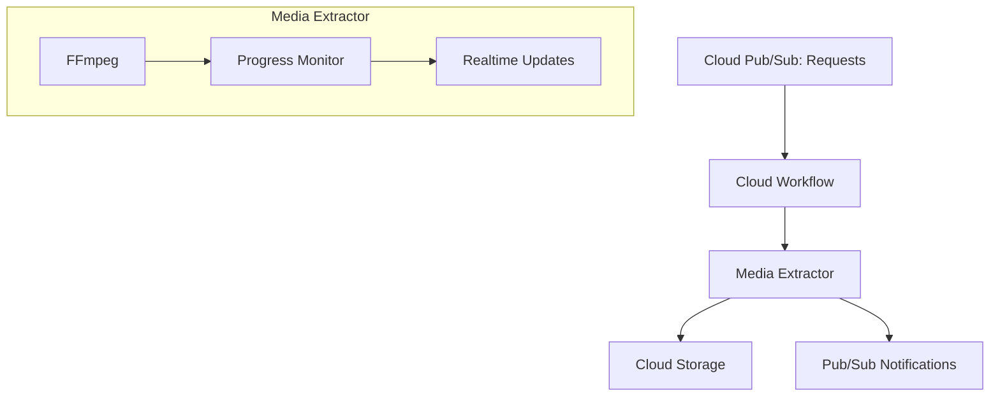
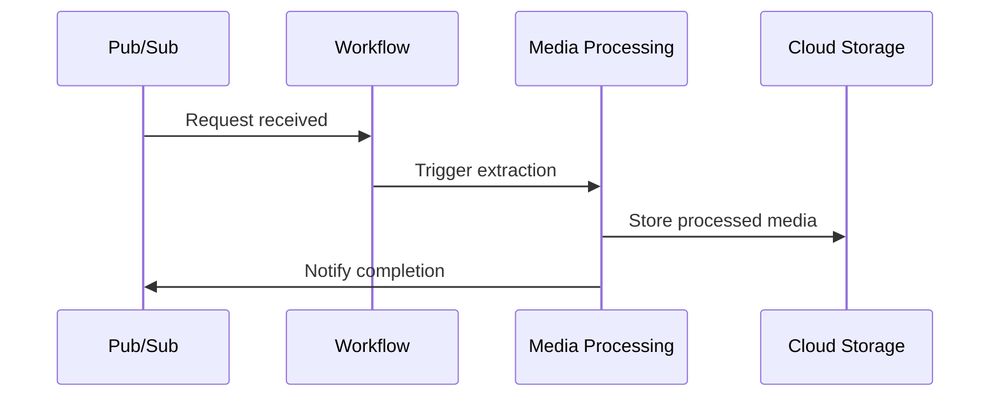

At Polyfact, my primary focus was on significantly enhancing the reliability and performance of the platform while managing cloud costs efficiently. Initially, Polyfact had a monolithic infrastructure hosted entirely on a single Google Cloud VM, causing substantial performance bottlenecks and rapidly increasing costs. This setup combined resource-intensive processes such as scraping content, audio-video processing with FFmpeg, and alerting mechanisms, all of which competed for limited CPU and RAM resources.

My first step was to decouple content scraping from media processing. I drastically downsized the VM resources by a factor of ten, keeping only the scraper on it. I then implemented a modern microservice architecture leveraging Google Cloud Run, Pub/Sub messaging queues, and Cloud Workflows. This allowed individual components to scale independently according to their specific resource needs:

- **Media Processing Service**: Leveraged Google Cloud Run jobs and Cloud Workflows triggered by Pub/Sub messages to handle media downloads and processing tasks asynchronously. The processed audio and video files are securely stored in Google Cloud Storage for future retrieval and processing, including potential facial recognition applications.

- **Alerting Service**: Developed a standalone alerting system separate from the scraper. It listens for new transcription entries in the database, automatically triggering email notifications when user-defined keywords appear, even from live stream transcriptions.

I also introduced significant enhancements to the scraping logic, removing inefficient HTML parsing and replacing it with streamlined string and regex operations, boosting performance by 2-3x and greatly improving maintainability and reliability.

Implemented full support for YouTube VOD and live streaming, including advanced tracking of live-to-VOD transitions, enabling automated video re-processing once live streams ended.

Additionally, I standardized our deployment process by introducing Terraform, significantly reducing deployment complexity, creating clearly defined dev/prod environments, and establishing robust guidelines for future releases.

I worked closely with the founder to iterate on product improvements and optimize user experience, ensuring technical decisions were always aligned with business goals and user satisfaction.

### Key Achievements

- 🚀 Reduced infrastructure costs significantly by decoupling resource-intensive tasks.
- 🎯 Enhanced system reliability through extensive debugging and real-time monitoring.
- 📈 Streamlined deployments and introduced clear dev/prod separation using Terraform.
- 📹 Implemented a robust processing pipeline supporting VOD and live streaming content.

### Infrastructure & Workflow

This work established a scalable, efficient, and highly maintainable infrastructure at Polyfact, laying a solid foundation for future growth.

